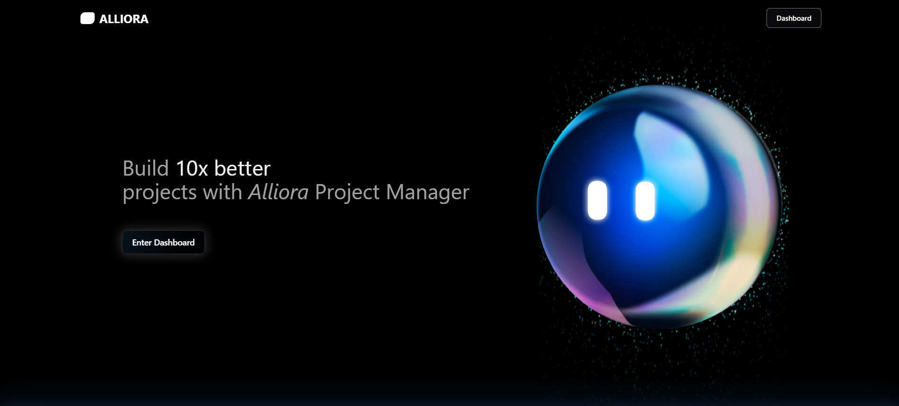
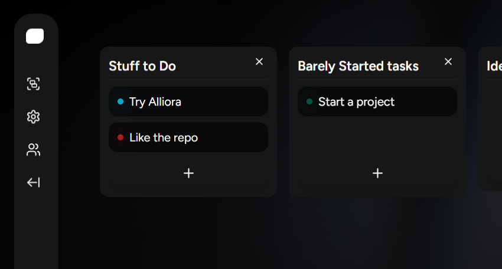
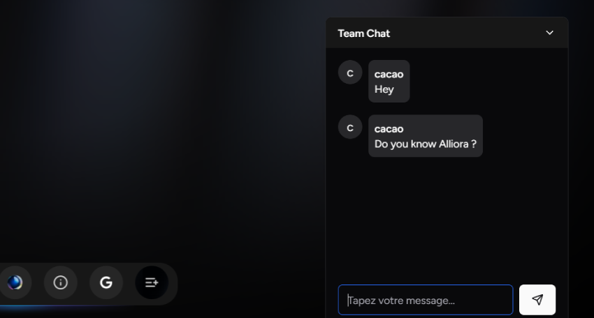
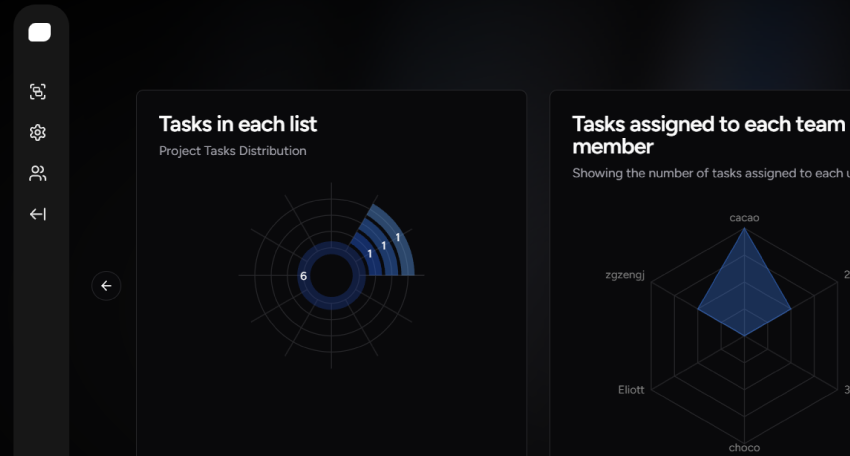

# 🌟 **Alliora - Modern Project Management System**  
  

**Alliora** is your ultimate tool for managing projects and teams with style and efficiency. Built with the latest technologies, it offers a powerful blend of **real-time updates**, **interactive dashboards**, and seamless **collaboration tools**.  

---

## 🚀 **Why Choose Alliora?**  

- **📂 [Project Management](#-core-features)**  
  Organize your projects with precision and keep everything on track.  
- **📝 [Task Boards](#-core-features)**  
  Manage your tasks visually with **drag-and-drop Kanban boards**.  
    

- **💬 [Team Collaboration](#-core-features)**  
  Chat with your team and stay updated with real-time notifications.  
    

- **📊 [Analytics & Insights](#-core-features)**  
  Gain actionable insights with **charts and project statistics**.  
    

---

## 🔑 **Core Features**  

### 🌟 **Key Capabilities**  
- **[Project Creation & Management](#-why-choose-alliora)**  
- **Kanban-Style Task Boards** with drag-and-drop functionality.  
- **Real-time Notifications & Updates** via WebSocket integration.  
- **Team Chat** for effective communication.  
- **Comprehensive Analytics & Charts** for better decision-making.  
- **Google Agenda Integration** to keep tasks synced across platforms.  

---

## 🛠️ **Technical Stack**  

| **Technology**       | **Details**                                                                 |
|-----------------------|-----------------------------------------------------------------------------|
| **Backend**           | [Laravel 11](https://laravel.com/)                                         |
| **Frontend**          | [React](https://react.dev/) with [Inertia.js](https://inertiajs.com/)       |
| **Real-time Updates** | [Pusher](https://pusher.com/) + [Laravel Echo](https://laravel.com/docs/11.x/broadcasting) |
| **UI Components**     | [Shadcn](https://shadcn.dev/) Components, Aceternity, [Tailwind CSS](https://tailwindcss.com/) |
| **Drag-and-Drop**     | [React Beautiful DnD](https://github.com/atlassian/react-beautiful-dnd)    |
| **Database**          | [SQLite](https://sqlite.org/index.html)                                   |
| **Charts**            | Shadcn Charting Components                                                |

---

## ⚡ **Getting Started**  

### **Prerequisites**  
Before installation, ensure your environment meets the following requirements:  
- [PHP](https://www.php.net/) >= 8.1  
- [Composer](https://getcomposer.org/)  
- [Node.js](https://nodejs.org/) & [NPM](https://www.npmjs.com/)  
- [SQLite](https://sqlite.org/index.html)  

### **Installation Steps**  

1. **Clone the Repository**  
   ```bash
   git clone https://github.com/wav-rover/Alliora.git
   ```  

2. **Install Dependencies**  
   - **Backend**  
     ```bash
     composer install
     ```  
   - **Frontend**  
     ```bash
     npm install
     ```  

3. **Set Environment Variables**  
   - Copy the `.env` file:  
     ```bash
     cp .env.example .env
     ```  
   - Configure the following keys in `.env`:  
     - `PUSHER_APP_KEY` (get it from [Pusher Dashboard](https://dashboard.pusher.com/)).  
     - `GOOGLE_API_KEY` (get it from [Google Cloud Console](https://console.cloud.google.com/)).  

4. **Generate Application Key**  
   ```bash
   php artisan key:generate
   ```  

5. **Run Migrations**  
   ```bash
   php artisan migrate
   ```  

6. **Start the Development Servers**  
   - Backend:  
     ```bash
     php artisan serve
     ```  
   - Frontend:  
     ```bash
     npm run dev
     ```  

---

## 🤝 **Contributing**  

We’re thrilled about your interest in contributing to **Alliora**! Here’s how you can help:  
1. Fork the repository.  
2. Create a feature branch:  
   ```bash
   git checkout -b feature-name
   ```  
3. Commit your changes and submit a pull request!  

---

## 🔐 **Security Vulnerabilities**  

If you identify a security issue, please contact our **security team** directly. We prioritize user safety and will address all vulnerabilities promptly.  

---

## 📜 **License**  

Alliora is not officially licensed as open-source software. It is a **study project** developed for educational purposes.  

---

🎉 **[Experience effortless project management with Alliora!](#-why-choose-alliora)**  
